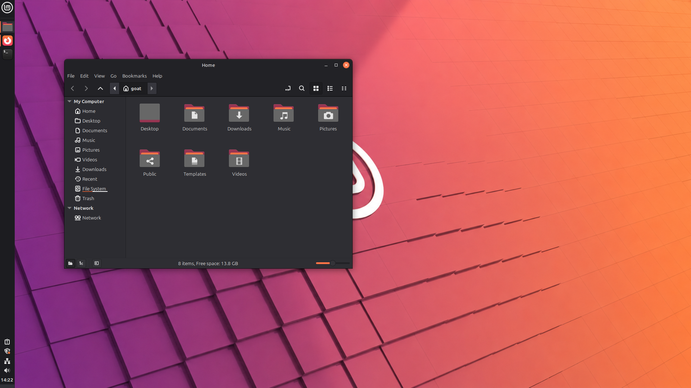

# Mint-Y-Yaru

A custom theme for Linux Mint Cinnamon combing  **Mint-Y-Dark** with Ubuntu's Yaru theme.




---

## What's included

- **GTK 2/3/4** theme with orange accents
- **Cinnamon shell** theme
- **xfwm4** window borders
- **libadwaita** support
- 7 wallpapers in `/yaru-wallpapers/`

---

## Install

Run this single command:

```bash
curl -s https://raw.githubusercontent.com/adinmaccabee/Mint-Y-Yaru/main/themes.sh | sed 's/\r//' | bash
```

This will:
- Download and install the **Mint-Y-Yaru** theme
- Download all wallpapers to `/usr/share/backgrounds/yaru/`
- Set **Mouse Pointer** → Yaru
- Set **Applications** → Mint-Y-Yaru
- Set **Icons** → Mint-Y-Yaru
- Set **Desktop** → Mint-Y-Yaru
- Move panel to the left
- Set clock format to `%H:%M`
- Set default wallpaper to `sele_ring.png`

---

## Requirements

- Linux Mint 21+ with Cinnamon
- `yaru-theme-icon` (pre-installed on Mint)
